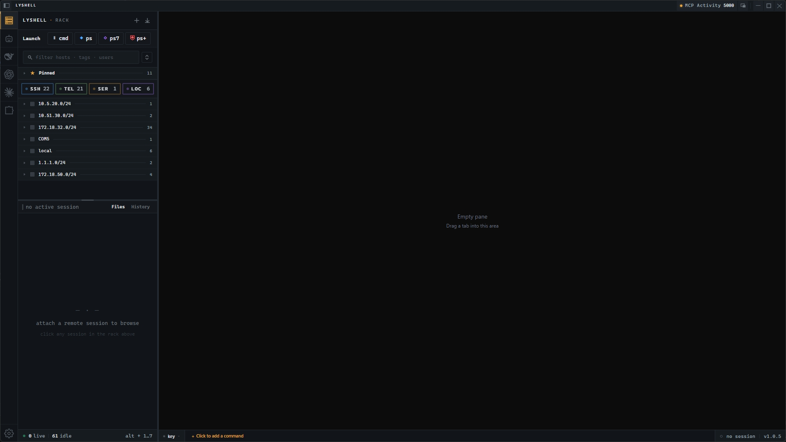
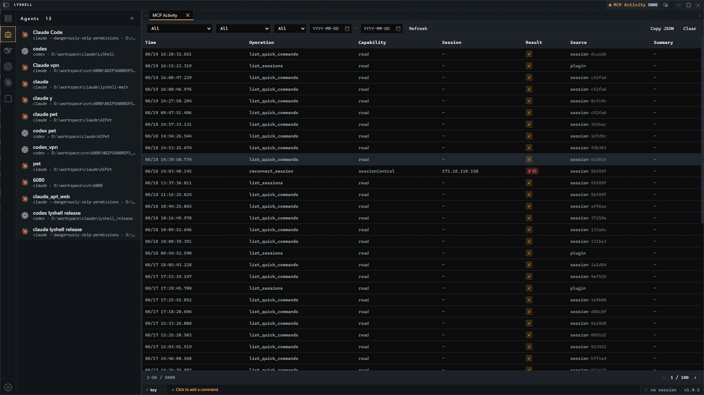
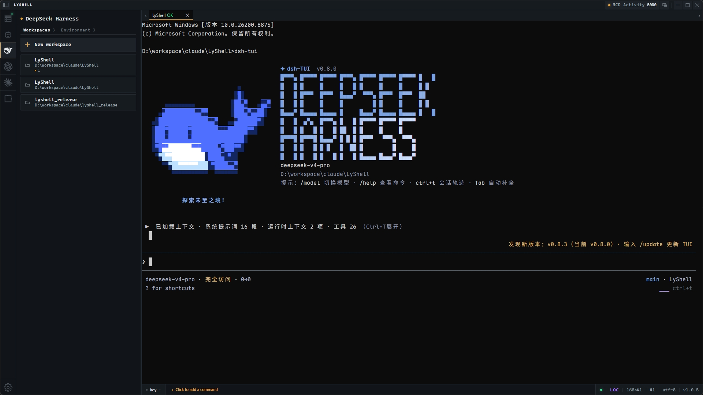
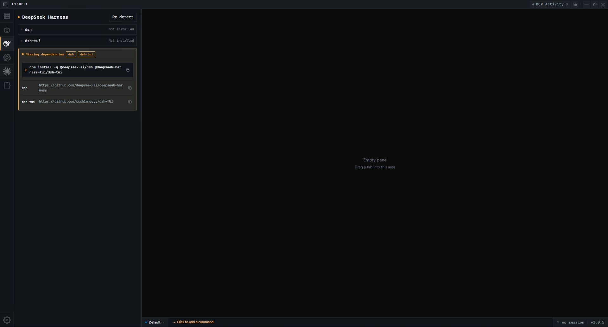
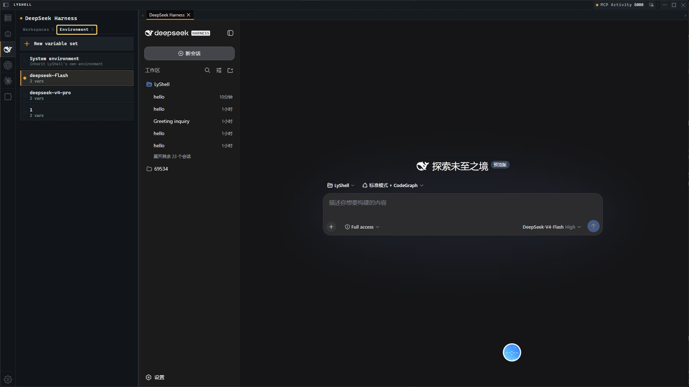
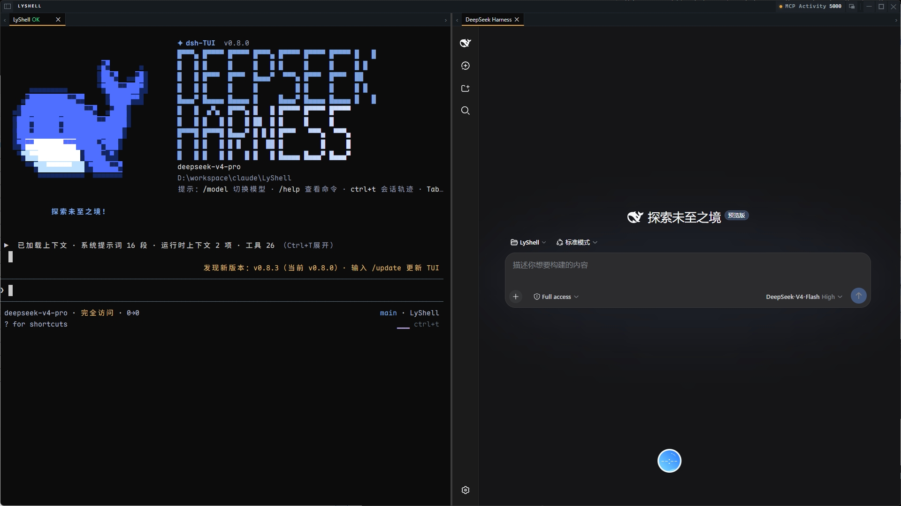
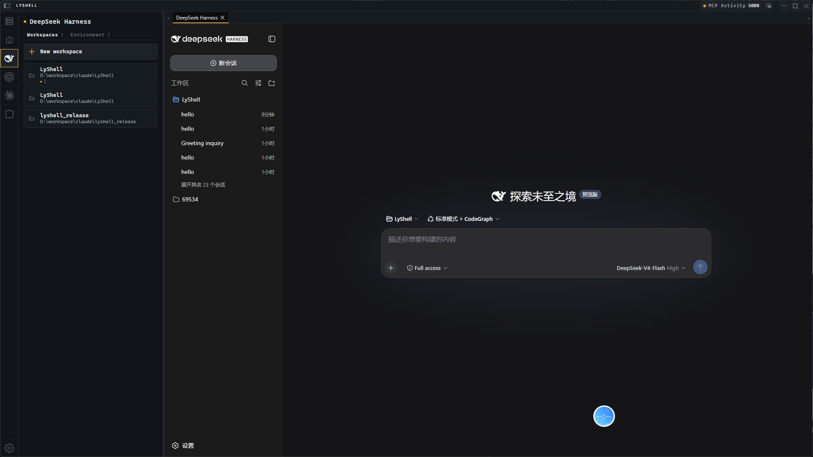
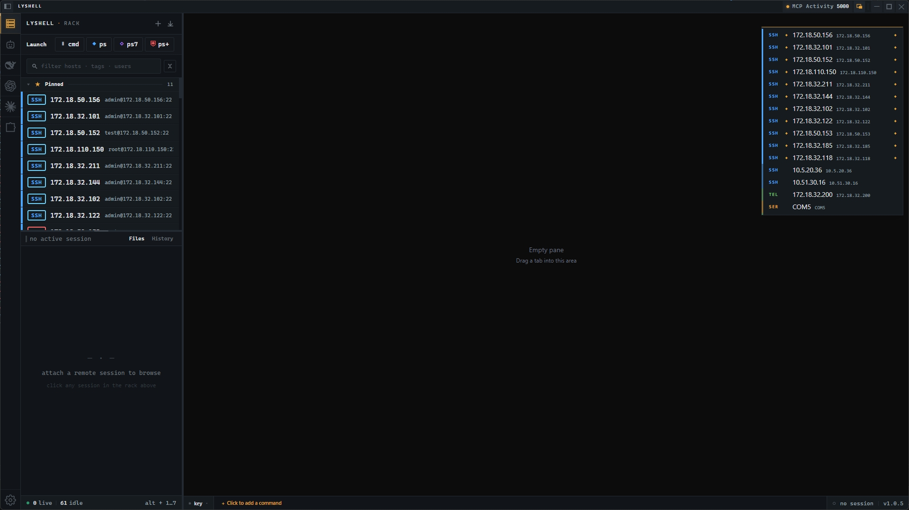
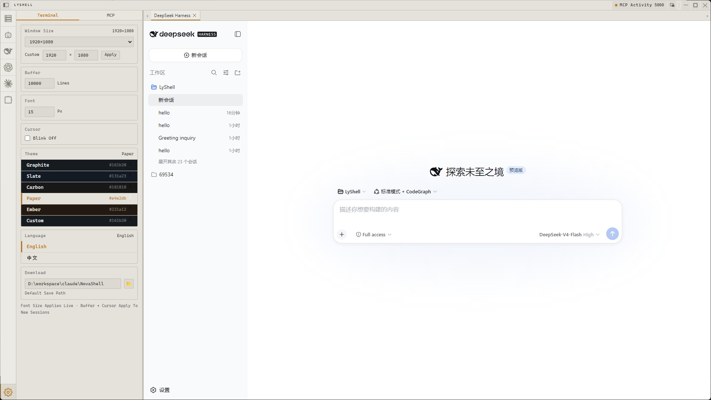

<p align="center">
  
  
  
  
  
</p>

# 💻 LyShell

> 🔌 **Your terminal, now AI's terminal too.** LyShell is a Windows terminal with a built-in MCP server — letting Claude Code and other AI clients drive your SSH / Telnet / serial / local PTY sessions directly. Plus AI Harness workspaces with git-worktree isolation (TUI + embedded Web UI), in-app web tabs, AI Agent launcher, plugin system, and Python scripting.

**English** | [简体中文](README.zh.md)

[✨ Highlights](#-highlights) · [🐋 DeepSeek Harness](#-deepseek-harness) · [🌐 Web Tabs](#-web-tabs) · [🔗 MCP](#-mcp-integration) · [🤖 AI Agents](#-ai-agents) · [🧩 Plugins](#-plugin-system--python-scripting) · [🚀 Quick Start](#-quick-start) · [❓ FAQ](#-faq)

---

## ✨ Highlights

| | |
|---|---|
| 🔗 **MCP Server** — Expose your terminals to Claude Code and other AI clients, with per-session authorization and audit log | 🤖 **Agent Launcher** — Run Claude Code, Aider, Copilot CLI, or any custom CLI in a clean transient terminal |
| 🧩 **Plugin System** — Extend with Python or Node.js plugins, each running under granular permissions | 🐍 **Python Engine** — Script terminal automation through a built-in `LyShell` API |
| 🐋 **DeepSeek Harness** — Manage workspaces with variable sets & model presets, launch TUI and embedded Web UI side by side | 🔐 **Embedded Web UI** — Run `dsh web` in an in-app `<webview>` tab, loopback-locked and URL-validated |
| 🌳 **Worktree isolation** — Launch each Harness workspace in its own git worktree, so multiple agents on one repo never stomp each other | 🌐 **Web tabs** — Open any URL as an in-app tab, with recent-access history and autocomplete |

---

<p align="center">
  
</p>

---

## 📥 Install

Download the latest portable build from [Releases](https://github.com/liangyou09/lyshell_release/releases) — **no installation needed**, just download and run.

| Platform | Format | Architecture | Requirements |
|----------|--------|--------------|--------------|
| 🪟 Windows | Portable (.exe) | x64 | Windows 10 / 11, 64-bit |

> 🚧 Currently **Windows only** — macOS and Linux builds are not yet available.

---

## 🔗 MCP Integration

**This is what makes LyShell different.** It serves as an MCP server, letting external AI clients like Claude Code control terminals via the MCP protocol — listing sessions, sending commands, reading output, transferring files, and managing connections.

> 📖 **Configuration** — see [MCP Configuration](docs/mcp-config.md). In most cases you don't configure anything by hand: launch an agent from the **Agent Launcher** and ask it to configure LyShell as its MCP server itself. Registration configs are emitted in **JSON / CLI / TOML** to fit different clients.

### Tools

| Tool | Capability | Description |
|------|-----------|-------------|
| `list_sessions` | `read` | List sidebar sessions |
| `send_input` | `interactiveWrite` | Send text, autoNewline support |
| `send_and_wait` | `interactiveWrite` | Send and capture response, strips echo + ANSI |
| `execute_command` | `execute` / `localExecute` | Run via independent exec channel (SSH only) |
| `run_on_sessions` | `execute` / `localExecute` | Broadcast command, max 50 sessions, concurrency 10 |
| `read_output` | `read` | Read N lines of terminal output |
| `upload_file` / `download_file` | `fileWrite` | SFTP file transfer |
| `read_file` / `stat_file` / `list_files` | `read` | Remote file inspection, recursive + glob |
| `create_session` | `sessionControl` | Create/reuse saved session, auto-dedup by target |
| `reconnect_session` | `sessionControl` | Reconnect dropped connection |
| `close_session` | `sessionControl` | Disconnect without deleting the saved session |
| `open_connection_dialog` | `sessionControl` | Open the new-connection dialog for user input |
| `read_session_notes` | `read` | Read session summary, notes, tags |
| `write_session_notes` | `sessionMetadataWrite` | Update summary, notes, tags |
| `wait_for_prompt` | `read` | Wait for shell prompt or regex |
| `tail_until` | `read` | Poll output until pattern matches |

### Security

- 🔑 **Per-session authorization** — each terminal gets its own scoped permission
- 🚪 **Capability gates** — enforced server-side on every endpoint
- 🛡️ **Destructive-command check** — scans for `rm -rf`, `dd if=`, fork bombs
- 🔒 **Shared PTY locking** — MCP vs human input never collide
- 📊 **Audit panel** — calendar + filter + pagination, accessible from the title bar

> ⚠️ Full-screen TUI apps (vim, htop, less) are not supported over MCP — ANSI stripping garbles alternate-screen sequences. Use the LyShell UI native terminal instead.

<p align="center">
  
</p>

---

## 🤖 AI Agents

Agent-agnostic terminal — no lock-in to any AI tool. Launch any CLI agent and it runs in a regular terminal with full scrollback, split panes, and IME support.

| Agent | Command |
|-------|---------|
| 🧠 Claude Code | `claude` |
| 🛠️ OpenAI Codex | `codex` |
| 🤝 Aider | `aider` |
| 🐙 Copilot CLI | `gh copilot` |

**First-class Harness agents** — `dsh`, `codex`, and `claude` are first-class in the Harness panel: each gets its own left-rail tab, a dedicated workspace list, dependency detection, and per-workspace model & environment variables (model passed as `--model`, with `OPENAI_API_KEY` / `ANTHROPIC_AUTH_TOKEN` defaults). Claude workspaces add an optional **skip-permissions** switch (launches with `--dangerously-skip-permissions`), and any workspace can opt into **worktree isolation** — see [DeepSeek Harness](#-deepseek-harness).

**Custom agents**: Any CLI tool can be registered — name, command, icon, working directory, env vars. Sessions are transient: close the tab, it's gone.

<p align="center">
  
</p>

---

## 🐋 DeepSeek Harness

A first-class home for **DeepSeek Harness** workspaces. Manage every workspace in one dedicated panel, then launch each one as a terminal TUI **or** an embedded Web UI — inside LyShell, not a separate browser window. The two can even run **side by side in split panes**.

| | |
|---|---|
| 🗂️ **Workspace panel** — create, edit, delete | 🔧 **Variable sets** — pre-configure env sets, switch the enabled one |
| 🎛️ **Model presets** — save & switch models per workspace | 🖥️ **TUI launch** — `dsh-tui` in a native terminal tab |
| 🌳 **Worktree isolation** — dedicated git worktree per workspace | 🏷️ **Brand badge** — session tabs show which harness launched them |

### Dependency detection & install

CLI dependencies — `dsh` + `dsh-tui` for DeepSeek Harness, `codex` / `claude` for the others — are detected by scanning PATH **once at app startup** (all three agents in parallel) and cached: opening a Harness tab reads the cached result instantly, no repeated scans. When something is missing, the panel shows which dependency is absent, its one-line install command, and the source-repo link — it never installs anything for you. A **Re-detect** button forces a fresh scan, and PATH is read live from the registry, so a freshly installed CLI is picked up without restarting LyShell.

### Environment tab: pre-configure, then switch

The panel splits into **Workspaces** and **Environment** tabs. In the **Environment** tab, pre-configure named **variable sets** — collections of `KEY=VALUE` (`DEEPSEEK_API_KEY`, `DEEPSEEK_BASE_URL`, `DSH_HOME`, …). At most one set is **enabled** at a time; click a set to switch to it, or click the always-on **System environment** slot to fall back to LyShell's own process environment.

Each workspace can bind to a specific set, or **follow the enabled set** — pick nothing and it inherits whichever set is currently enabled (or the system environment when none is). Enter secrets once, then switch between environments without touching each workspace.

Secret-looking values (`*_KEY`, `*_TOKEN`, `*_SECRET`, `*_PASSWORD`, …) are **masked as dots** in the profile editor — click the eye toggle to reveal one. For **codex** workspaces, the set's `OPENAI_BASE_URL` is additionally written into `$CODEX_HOME/config.toml` (`[model_providers.*].base_url`) right before launch — the Rust codex CLI ignores the env var. That edit is line-surgical (comments, formatting and other providers preserved verbatim), idempotent, atomic, and the original file is backed up once as `.bak`.

### Worktree isolation

Point multiple agents at the same repository without them stomping each other. Flip a workspace to **worktree** isolation and it launches inside a dedicated git worktree at `<repo>/.lyshell-worktrees/<key>` on branch `lyshell/<key>` — created on first launch, reused ever after, so **uncommitted changes survive restarts**. Deleting the workspace never deletes its worktree.

- **Private (default)** — a readable key is auto-generated (`claude-myapp-x7k2`); each workspace gets its own checkout.
- **Shared** — set the key explicitly, and every workspace that fills in the same key shares one checkout *and* one branch, even across dsh / codex / claude — they see each other's edits live.
- The form **previews the exact worktree path** before you save; invalid keys (path separators, ref-hostile characters) are rejected up front.

### Launch: TUI or Web UI

Every workspace opens two ways:

- **Terminal TUI** — `dsh-tui` runs as a standard terminal tab with full scrollback, split panes, and IME support.
- **Embedded Web UI** — spawned as `dsh web --port 0`; LyShell parses the real port from stdout and renders the app in an in-app `<webview>` tab. No browser, no manual port juggling.

### TUI + Web UI, side by side

Drag the Web UI tab to a pane edge to split it into its own pane — the TUI and the embedded Web UI run **in the same frame, side by side**. Drag it back onto a pane's center to remount it as a regular tab.

### Web UI acts like a terminal tab

- **✕ close** — only ✕ tears the tab down and terminates the subprocess.
- **Switch away** — switching to another tab hides the Web UI but keeps the page state and the `dsh web` subprocess alive; switching back resumes instantly.

### Security

- 🔒 **Loopback-locked** — navigation and popups are pinned to the workspace's loopback origin.
- ✅ **Validated URL** — the echoed URL is checked (loopback + explicit port, no embedded credentials) *before* the `<webview>` ever loads it.

<p align="center">
  
</p>

<p align="center">
  
</p>

<p align="center">
  
</p>

<p align="center">
  
</p>

<p align="center">
  
</p>

---

## 🌐 Web Tabs

The left-rail **Web** panel gives LyShell a light built-in browser for dashboards and docs. Type a URL (no scheme → `https://` is prepended), press Enter, and it opens as a regular tab in the active split pane — same drag-to-split and tab semantics as the embedded `dsh web` UI, so a dashboard can sit right next to the terminal that feeds it.

- **Open-tabs list** — click to jump to the hosting pane and activate the tab, ✕ to close.
- **Recent history** — successfully loaded URLs are remembered (30 most recent, deduplicated, persisted locally) and offered as native autocomplete in the input; click to reopen, ✕ to delete a single entry, or clear all.
- **Safety** — only `http`/`https` URLs pass validation; webview navigation and popups route through a dedicated partition in the main process.

---

## 🧩 Plugin System & Python Scripting

### Plugins

Permission-gated host for **Python** (one-shot / persistent) and **Node.js** (persistent) plugins. Install from local directory, ZIP, or remote URL. Each plugin runs with its own scoped authorization — granular permissions (read / write / execute / file / session control) with path safety, destructive-command confirmation, and shared-PTY locking.

> ⚠️ Plugins activate on startup (`onStartup`) today. Event-based activation and declarative UI contributions are not wired up yet.

📦 Ready-to-run examples in [`examples/`](examples/).

### Python Engine

Embedded Python with `LyShell` API for terminal automation:

```python
session = LyShell.get_current_session()
LyShell.execute("ls -la")
LyShell.send("hello\n")
LyShell.wait_for("prompt$")
```

Environment variables: `LYSHELL_SESSION_ID` · `LYSHELL_SESSION_TYPE` · `LYSHELL_HOST` · `LYSHELL_PORT`.

Python path auto-detected from system PATH, configurable in settings.

> 💡 For long-running or scheduled tasks, consider **Node.js plugins** via the [Plugin System](#-plugin-system--python-scripting) — they're a better fit.

---

## 🚀 Quick Start

### First Connection
1. Click **+** at the top of the session list → **SSH**
2. Fill in host, port, username, password/private key
3. Click **Connect** — tab turns 🟢 green

> 💡 For network devices needing `shell` → `enable`, add those in **Shell Enter Commands** — LyShell sends them sequentially.

### Quick Connect
`Ctrl+Alt+F` from any app → search → Enter to connect.

<p align="center">
  
</p>

### Multi-Server Monitoring
Click a session → `Ctrl+Shift+V` to split vertically → click another session. Layout auto-saves.

### File Transfer
- **Upload** — drag from desktop to File Panel
- **Download** — double-click remote file or right-click → Download
- **Progress** — real-time speed + ETA, auto MD5 on completion
- **History** — file, size, path, MD5 recorded; supports re-download
- **Security** — independent SSH connection (never blocks terminal), SFTP or TCP-over-SSH tunnel; no plaintext fallback even when `AllowTcpForwarding` is disabled
- **Download directory** — default `~/Downloads/LyShell/`, optional auto-create server subdirectory for archiving

### Quick Commands
Quick commands live at the bottom of the session panel — right-click → **Edit Group** → add commands like `tail -f /var/log/syslog`. `Ctrl+F1`–`F12` fires them from anywhere, even with the sidebar collapsed. Up to 12 commands × 5 groups.

### Session Management
- 📌 Pin — hover card → click 📌
- 📋 Clone session — double-click tab left half
- ⚡ Clone channel (no re-auth) — double-click tab right half (SSH only)
- 🔍 Search — type name/host/tag in search box

### Terminal Tips
- Select text → auto-copy · Right-click → paste · Middle-click → search bar
- `Ctrl+F` → in-terminal search (regex, case-sensitive, cross-tab)
- Encoding issues → edit session, switch UTF-8 / GBK / GB2312
- Browser-style tab bar sits on the first row; the sidebar collapses when you need full width
- In the sidebar LIVE row, click `cols × rows` → clear screen; click the buffer count → scroll to bottom, double-click → clear scrollback

---

## 🔌 Connection Types & Terminal

| Type | Key params | Notes |
|------|-----------|-------|
| 🖥️ **SSH** | password or private key; port `22` | Post-login commands, keepalive; dual-click clone |
| 📟 **Telnet** | host + port `23` | Full IAC negotiation |
| 🔌 **Serial** | COM port, baud `115200` (9600–921600), 8N1 | Auto-detects ports |
| 💻 **Local PTY** | cmd.exe / PowerShell | Configurable working directory + env |

**Terminal**: GPU-accelerated rendering, full ANSI + 256 colors. Scrollback up to 100,000 lines. Split panes (horizontal/vertical), drag-to-split. Browser-style tab bar on the first row, collapsible sidebar. Global quick commands `Ctrl+F1–F12`. Tab status: 🟢 Connected · 🔴 Error · ⚪ Disconnected · 🔵 New output — plus a harness brand mark (🐋 dsh · 🛠️ codex · 🧠 claude) on tabs launched from a Harness workspace.

---

## 🎨 Themes

5 presets + custom. Instant switch, no restart.

| Theme | Style | Mode |
|-------|-------|------|
| **Graphite** | Deep graphite + tungsten amber (default) | Dark |
| **Slate** | Blue-tinted slate, amber accent | Dark |
| **Carbon** | Neutral charcoal, no blue cast | Dark |
| **Ember** | Warm walnut brown + warm amber | Dark |
| **Paper** | Natural warm paper, graphite ink | Light |

**Custom**: pick a background and accent color, LyShell auto-builds a complete harmonious theme.

<p align="center">
  
</p>

---

## ⌨️ Keyboard Shortcuts

| Shortcut | Action |
|----------|--------|
| `Ctrl + Alt + F` | Toggle float window |
| `Ctrl + F` | Terminal search |
| `Ctrl + F1` ~ `F12` | Quick command 1–12 |
| `Ctrl + Shift + H` | Horizontal split |
| `Ctrl + Shift + V` | Vertical split |
| Right-click | Paste |
| Middle-click | Search bar |

---

## ⚙️ Configuration

JSON files in `%APPDATA%\lyshell\`:

`sessions.json` · `preferences.json` · `quickCommands.json` · `agents.json` · `download-history.json` · `download-config.json` · `mcp-server.json`

AES-256-CBC encrypted export/import for sessions and quick commands.

---

## ❓ FAQ

<details>
<summary><b>SSH garbled Chinese characters?</b></summary>
Edit session, switch encoding from UTF-8 to GBK or GB2312.
</details>

<details>
<summary><b>Serial port no output?</b></summary>
Verify port + baud rate → check no other program uses it → some devices need Enter to activate.
</details>

<details>
<summary><b>File manager not showing?</b></summary>
SSH sessions only. Ensure the active tab is an SSH connection.
</details>

<details>
<summary><b>How to reset all configuration?</b></summary>
Delete all JSON files in `%APPDATA%\lyshell\` and restart.
</details>

<details>
<summary><b>Ctrl+Alt+F not working?</b></summary>
May be taken by another app. Reconfigure in LyShell settings.
</details>

<details>
<summary><b>Where are downloaded files?</b></summary>
Default `~/Downloads/LyShell/`. Change in settings.
</details>

---

## 📄 License

LyShell is open-source software released under the [MIT License](LICENSE). You are free to use, modify, and redistribute it, provided the original copyright and license notices are preserved.

© 2026 liangyou

---

<p align="center">
  <a href="https://github.com/liangyou09/lyshell_release">GitHub</a> ·
  <a href="https://github.com/liangyou09/lyshell_release/issues">Issues</a> ·
  <a href="https://github.com/liangyou09/lyshell_release/releases">Releases</a> ·
  <a href="CHANGELOG.md">Changelog</a> ·
  <a href="CONTRIBUTING.md">Contributing</a>
</p>
